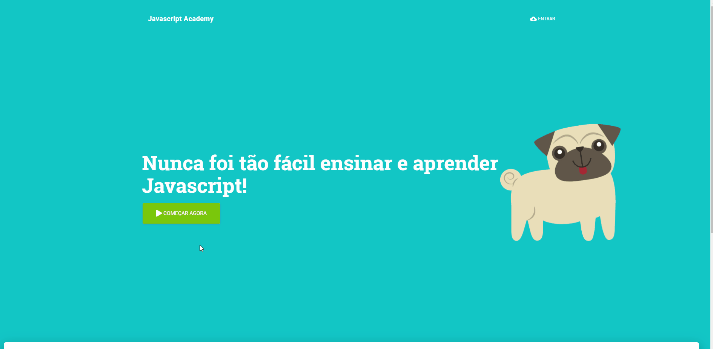
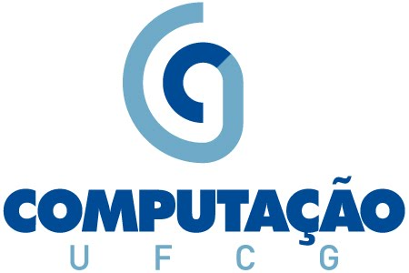

# Javascript Academy

Javascript Academy is a web platform that you can create, share and answer lessons in javascript with automatic judge.

## Development

Make sure you have [Node](https://nodejs.org) version >= 9.x.

After that, clone the repository and run:`npm install`
Run the app: `npm start`

Before start coding, create a branch for what you're going to do so you can create a pull request later on. To create a new branch, do:
`git checkout -b <name-of-branch>`
After you finish your work, commit everything and then merge with the master branch so you can resolve merge conflicts before creating the pull request.

- `git commit -m <message>`
- `git fetch origin master`
- `git merge origin master`

Commit again and then push to **your** branch:

- `git commit -m <message>`
- `git push origin <name-of-branch>`

Now go to GitHub and create the pull request. Wait for someone to approve your changes before merging with the master branch.

:loudspeaker: **Disclaimer:** This project it's part of my course completion work.

